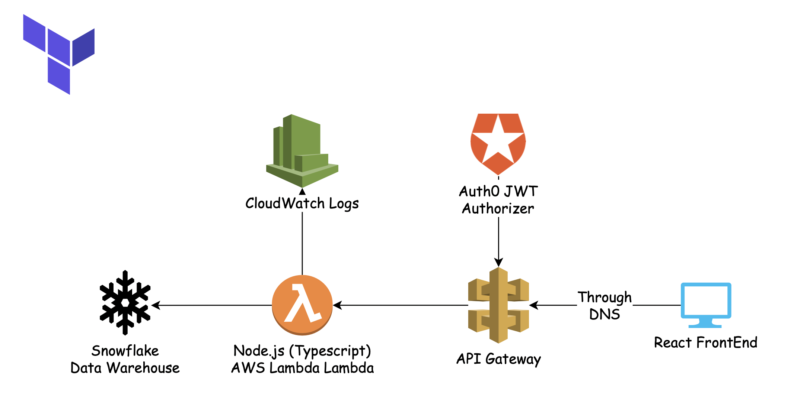

# NodeJS TS Lambda

## NodeJS Development

This project uses typescript, which compiles into javascript

1. Crete .env using the bundled example and supply the required variables

        cp .env.example .env

2. Install Dependencies for Local Development

        yarn

3. Package for Terraform Deployment

        yarn package

## Terraform Initial Setup

1. Make use your console is logged into aws-cli.

2. Terraform needs a place to store state. This can be updated in main.tf

        backend "s3" {
                bucket = "<s3-bucket-where-project-state-can-be-stored>"
                key    = "<a-key-name-for-the-project>"
                region = "<bucket-region>"
        }

3. Create a file "terraform.tfvars" in the root directory by copying the example. This file should contain environment variables.

        cp terraform.tfvars.example terraform.tfvars

        terraform init

## Terraform Deployment

        terraform apply